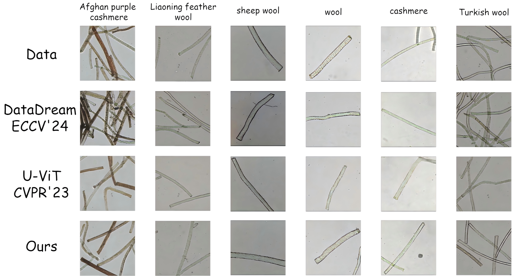

# DFt: A Diffusion Transformer with Dual-Frequency Scaling Tanh for Few-Shot Wool and Cashmere Fibers Detection (Journal of Natural Fibers 2025)
[Paper][(https://drive.google.com/file/d/13StUdrjaaSXjfqqF7M47BzPyhMAArQ4u/view?usp=share_link](https://www.tandfonline.com/doi/full/10.1080/15440478.2025.2594606)) |  Run DFt


The accurate identification of wool and cashmere fibers is crucial for textile quality, yet hindered by their visual similarity and the scarcity of annotated microscopic images. While deep learning techniques offer a high-accuracy, cost-effective identification tech nique, they are still limited by challenges arising from insufficient data scale and the high acquisition costs of obtaining high-quality fiber images. Although data augmentation partially alleviates data scarcity challenges, classical image augmentation techniques remain limited in generating high-fidelity, diverse fiber images, particularly in low- texture regions. This paper proposes a Transformer-based frequency-domain adaptive diffusion model incorporating a novel Dual-Frequency Scaling Tanh layer. The proposed method was evaluated on 1,845 high-quality fiber images (15 classes) provided by a National Fiber Quality Supervision and Inspection Center. The proposed approach demonstrates superior performance, outperforming all state-of-the-art baselines. 

Compared to classical image augmentation methods, our approach achieves perfor mance gains of +0.02 F1-Confidence and +1.88% mAP@0.5 in detection tasks, along with +0.05 F1-score, +4.83% precision, and +2.51% recall in classification tasks. These improvements demonstrate the method’s efficacy in generating high-fidelity, diverse data samples for intelligent fiber detection, while establishing an effective optimization strategy for deep learning model training.



*Figure 4 compares generated samples from our DFt model against state-of-the-art baselines including DataDream, U-ViT, and various wool/cashmere types. The proposed method demonstrates exceptional preservation of microscopic scale patterns essential for accurate fiber identification.*
# Pretrained Models
💡Pre-trained models can be downloaded [here](https://drive.google.com/file/d/13StUdrjaaSXjfqqF7M47BzPyhMAArQ4u/view?usp=share_link) (256*256 DFt)

# Preparation Before Training and Evaluation
### Autoencoder
💡Download `stable-diffusion` directory from this [link](https://drive.google.com/drive/folders/1yo-XhqbPue3rp5P57j6QbA5QZx6KybvP?usp=sharing) (which contains image autoencoders converted from [Stable Diffusion](https://github.com/CompVis/stable-diffusion)). Put the downloaded directory as `assets/stable-diffusion` in this codebase. The autoencoders are used in latent diffusion models.

### Reference statistics for FID
Download `fid_stats` directory from this [link](https://drive.google.com/drive/folders/1yo-XhqbPue3rp5P57j6QbA5QZx6KybvP?usp=sharing) (which contains reference statistics for FID). Put the downloaded directory as `assets/fid_stats` in this codebase. In addition to evaluation, these reference statistics are used to monitor FID during the training process.
### Data
💡256*256: Put the standard yours dataset (which contains the `train` and `val` directory) to `assets/datasets/wool_256`.

### environment


```
conda create -n DFt python==3.9
conda activate DFt
# For CUDA 11.6 (compatible with RTX 30/40 series)
pip install torch\==1.13.1 torchvision\==0.14.1 --extra-index-url https://download.pytorch.org/whl/cu116
# For CPU-only (not recommended for training)
pip install torch\==1.13.1 torchvision\==0.14.1
pip install -r requirements.txt
```

## Training
🪐You can use the following commands to conduct model training.

```
accelerate launch --multi_gpu --num_processes 8 --mixed_precision fp16 train.py --config=configs/wool_256.py 
```
## generate
🪐Run the following code for inference to generate the required synthetic image. 
🛸If you want to keep these images, set `--config.sample.path=/save/dir`.
```
accelerate launch --multi_gpu --num_processes 8 --mixed_precision fp16 eval.py --config=configs/wool_256.py --nnet_path=wool_256_DFt.pth
```
## References
If you find the code useful for your research, please consider citing.
```
@inproceedings{zhang2025dft,
  title={DFt: A Diffusion Transformer with Dual-Frequency Scaling Tanh for Few-Shot Wool and Cashmere Fibers Detection},
  author={Zhang, Ledun and Ji, Yatu and Wang, Shuo and Yao, Xinying},
  booktitle={Journal of Natural Fibers},
  volume={22},
  number={1},
  year={2025},
  doi={10.1080/15440478.2025.2594606}
}
```
